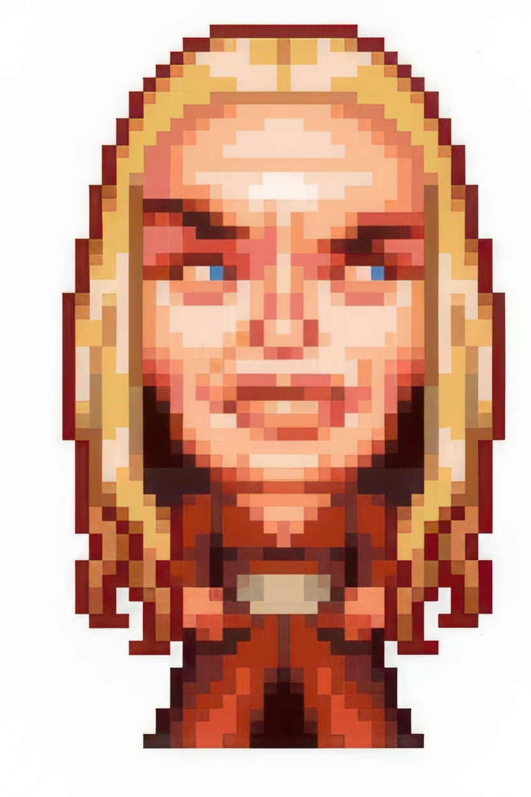

# Aseprite Restore Pixel Art / Aseprite 像素画修复

A script and instructions to restore pixel art that has been poorly resized or corrupted. Use the `restore-pixel-art.lua` script in Aseprite to downscale and repair images while preserving the pixel art style.

用于修复被错误缩放或损坏的像素画的脚本与说明。在 Aseprite 中使用 `restore-pixel-art.lua` 脚本，可以在下采样（缩小）的同时修复图像，并保留像素画风格。

## Features / 功能

-   Prompts for a "Pixel Block Size" to determine the correct downscale factor.
    
    弹窗提示输入“像素块尺寸”来确定正确的缩小比例。
-   Resizes the image to its original pixel art dimensions.
    
    将图像缩小到其原始的像素画尺寸。

## Installation / 安装

1.  **Add Script**: In Aseprite, go to `File > Scripts > Open Scripts Folder` and copy this `.lua` file into that folder.

    **添加脚本**：在 Aseprite 中，点击菜单 `File > Scripts > Open Scripts Folder`，然后将此 `.lua` 文件复制进去。
2.  **Reload Scripts**: The script will now appear in the `File > Scripts` menu.

    **重载脚本**：脚本会立刻出现在 `File > Scripts` 菜单中。

## Usage / 使用方法

1.  Open your enlarged image in Aseprite.
    
    在 Aseprite 中打开你被放大的图像。
2.  Run the script `restore-pixel-art` from the `File > Scripts` menu.
    
    从 `File > Scripts` 菜单中运行此脚本  `restore-pixel-art` 。
3.  A dialog box will appear. Enter the `Detected Pixel Block Size`. This is the size of one "original" pixel in your current enlarged image (e.g., if a single pixel is now a 9x9 block, enter `9`).

    脚本会弹出一个对话框。请输入 `Detected Pixel Block Size`（检测到的像素块尺寸）。这个值是你当前图像中，一个原始像素被放大后所占的边长（例如，如果一个原始像素点现在是一个 9x9 的方块，就输入 `9`）。
4.  Click `Run Resize`.
    
    点击 `Run Resize`。

### Example / 示例

-   Original image
    : `pixel-art.png` (832 × 1248)

    原图: `pixel-art.png` (832 × 1248)

    

-   Detected pixel block size: `18`

    检测到的像素块尺寸: `18`
-   Restored output: `restored-pixel-art.png`

    修复后输出: `restored-pixel-art.png`

    

## License / 许可证

MIT License
MIT 许可证